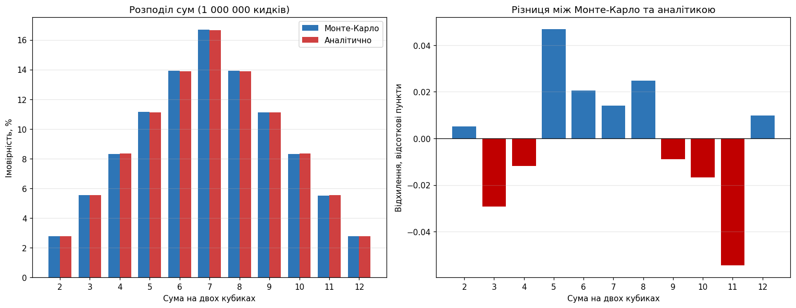

# Метод Монте-Карло: кидання двох гральних кубиків

Симуляція кидання двох кубиків, обчислення емпіричних імовірностей кожної суми та порівняння з аналітичними значеннями.

## Методика

Симуляція повністю векторизована через `numpy`: два масиви по n випадкових значень від 1 до 6 додаються поелементно, а `np.bincount` рахує входження кожної суми за один прохід. Циклів Python немає, тому 10 мільйонів кидків обробляються за частки секунди.

Генератор `np.random.default_rng(42)` забезпечує відтворюваність результатів.

Запуск: `python dice_monte_carlo.py`

## Аналітичні очікування

При киданні двох кубиків існує 6 × 6 = 36 рівноймовірних результатів. Кількість способів отримати суму s дорівнює `6 - |7 - s|`, тому розподіл симетричний з піком на сімці.

## Результати симуляції

Мільйон кидків:

| Сума | Випадінь | Монте-Карло | Аналітично | Відхилення |
|---:|---:|---:|---:|---:|
| 2 | 27 829 | 2.7829% | 2.7778% (1/36) | 0.18% |
| 3 | 55 264 | 5.5264% | 5.5556% (2/36) | 0.52% |
| 4 | 83 216 | 8.3216% | 8.3333% (3/36) | 0.14% |
| 5 | 111 580 | 11.1580% | 11.1111% (4/36) | 0.42% |
| 6 | 139 094 | 13.9094% | 13.8889% (5/36) | 0.15% |
| 7 | 166 807 | 16.6807% | 16.6667% (6/36) | **0.08%** |
| 8 | 139 136 | 13.9136% | 13.8889% (5/36) | 0.18% |
| 9 | 111 021 | 11.1021% | 11.1111% (4/36) | 0.08% |
| 10 | 83 166 | 8.3166% | 8.3333% (3/36) | 0.20% |
| 11 | 55 010 | 5.5010% | 5.5556% (2/36) | 0.98% |
| 12 | 27 877 | 2.7877% | 2.7778% (1/36) | 0.36% |

Максимальне відносне відхилення: **0.98%**, сума ймовірностей рівно 100%.

Ліва панель показує накладені стовпчики емпіричних та аналітичних значень (візуально майже нерозрізненні), права панель показує абсолютні відхилення у відсоткових пунктах. Максимальне відхилення не перевищує 0.06 відсоткового пункту.

## Збіжність

| Кидків | Макс. відхилення | P(7), % | P(2), % |
|---:|---:|---:|---:|
| 100 | 44.00% | 16.000 | 3.000 |
| 1 000 | 19.70% | 18.700 | 2.900 |
| 10 000 | 5.96% | 16.560 | 2.940 |
| 100 000 | 2.73% | 16.884 | 2.702 |
| 1 000 000 | 0.98% | 16.681 | 2.783 |
| 10 000 000 | 0.19% | 16.653 | 2.776 |

Збільшення кількості кидків у 100 разів (з 10 тисяч до мільйона) зменшує відхилення приблизно у 6 разів (5.96% -> 0.98%). Це узгоджується з теоретичною оцінкою похибки `O(1/√n)`: корінь зі 100 дорівнює 10, а спостережуване покращення того ж порядку з поправкою на випадковість окремих запусків.

## Висновки

**1. Метод Монте-Карло відтворює аналітичний розподіл з високою точністю.** На мільйоні кидків максимальне відхилення склало 0.98%, а для найімовірнішої суми 7 лише 0.08%. Форма розподілу (симетричний трикутник з піком на сімці) відтворилась повністю.

**2. Точність нерівномірна по сумах.** Найбільші відносні відхилення припадають на **рідкісні** суми: 11 (0.98%) та 3 (0.52%), тоді як центральні суми 7 і 9 дали 0.08%. Причина суто статистична: сума 7 випала 166 807 разів, а сума 2 лише 27 829, тобто у 6 разів рідше. Чим менше спостережень у категорії, тим більший відносний розкид. Це важливо пам'ятати при оцінці рідкісних подій: щоб отримати ту саму відносну точність для хвостів розподілу, потрібно значно більше випробувань.

**3. Похибка спадає як `1/√n`, а не лінійно.** Це головна практична особливість методу. На 100 кидках відхилення сягало 44%, тобто результат був фактично непридатним. Прийнятна точність починається приблизно з 10 тисяч кидків, а для трьох значущих цифр потрібен мільйон і більше. Кожен наступний десятковий знак коштує у 100 разів більше обчислень.

**4. Симетрія розподілу відтворилась природним чином.** Емпіричні значення для пар сум (2 і 12, 3 і 11, 4 і 10, 5 і 9, 6 і 8) виявились дуже близькими: 2.7829% проти 2.7877%, 13.9094% проти 13.9136%. Симуляція нічого не знала про симетрію, вона виникла сама як наслідок рівноймовірності граней.

**5. Практичне зауваження.** Для цієї задачі метод Монте-Карло надлишковий: простір подій складається всього з 36 варіантів, і точну відповідь можна отримати повним перебором миттєво. Цінність симуляції тут навчальна. Реальна перевага методу з'являється там, де аналітичний розрахунок неможливий: багато кубиків з різною кількістю граней, складні правила гри, залежні події або задачі, де простір станів надто великий для перебору.

**Підсумок:** результати Монте-Карло підтверджують аналітичні розрахунки. Розбіжності знаходяться в межах статистичної похибки і систематично зменшуються зі зростанням кількості випробувань, що доводить коректність як симуляції, так і теоретичної моделі.
